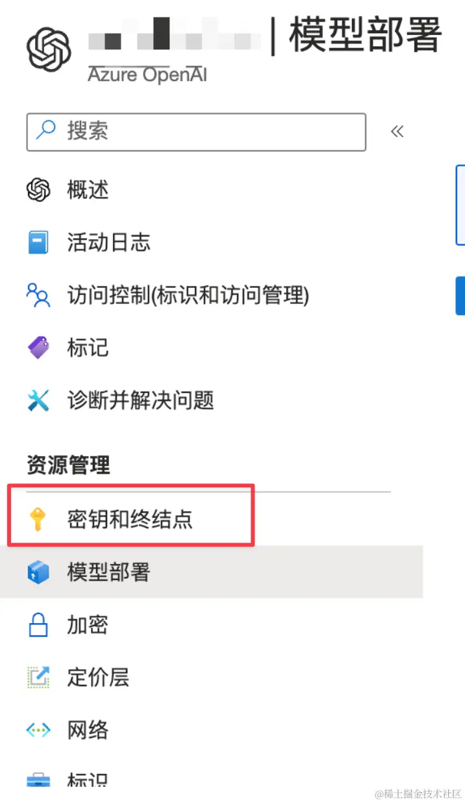

# Langchain.js 入门课

## 环境变量配置

本项目使用 OpenAI 的 LLM 和 Embedding 的 API，可以选择 OpenAI 官方 API 或者使用 Azure OpenAI 服务，如果使用其他 LLM 和 Embedding API，请自行查阅 langchain.js 和对应 API 的文档。

### OpenAI

如果你是 OpenAI 官方 API 用户，在 .env 中配置以下环境变量：

```shell
OPENAI_API_KEY=<your-key>
```

如果使用 OpenAI API，可能需要在创建 `OpenAIEmbeddings` 时手动指定 model 参数，来确定使用的 embedding model，具体请参考：https://js.langchain.com/v0.2/docs/integrations/text_embedding/openai/

参考文档：

- https://js.langchain.com/v0.2/docs/integrations/llms/openai/
- https://v02.api.js.langchain.com/classes/_langchain_openai.OpenAI.html

### Azure OpenAI

如果你使用的 Azure OpenAI 服务，需要在 .env 配置以下环境变量：

创建和部署 Azure OpenAI 服务的教程可以参考 [这里](https://learn.microsoft.com/en-us/azure/ai-services/openai/how-to/create-resource?pivots=web-portal)， 以及其他 Azure OpenAI 官方文档和教程。

```shell
AZURE_OPENAI_API_KEY=abc
AZURE_OPENAI_API_VERSION=abc
AZURE_OPENAI_API_DEPLOYMENT_NAME=abc
AZURE_OPENAI_API_INSTANCE_NAME=abc
AZURE_OPENAI_API_EMBEDDINGS_DEPLOYMENT_NAME=abc
```

- AZURE_OPENAI_API_KEY 是你部署的服务的 Key, 可以在下图中的 密钥和终结点中找到。
- AZURE_OPENAI_API_VERSION 是使用的 API 版本，本课程使用的是 2024-05-01-preview。
- AZURE_OPENAI_API_INSTANCE_NAME 是你部署服务的名称，也就是下面截图左上角打码部分的名称
- AZURE_OPENAI_API_DEPLOYMENT_NAME 是你部署的模型实例的名称，如不理解可参考 [这里](https://learn.microsoft.com/en-us/azure/ai-services/openai/how-to/create-resource?pivots=web-portal#deploy-a-model) 对 Deployment name 的概念介绍。
- AZURE_OPENAI_API_EMBEDDINGS_DEPLOYMENT_NAME 是你用于 embedding 的模型实例名称。



在配置时遇到问题，可以查阅文档：

- https://js.langchain.com/v0.2/docs/integrations/llms/azure/
- https://v02.api.js.langchain.com/classes/_langchain_openai.AzureOpenAI.html
- https://learn.microsoft.com/en-us/azure/ai-services/openai/

## Langchain Basic

介绍基础的 langchain.js LCEL Chain 的使用方式  
[code](./Langchain-Basic/index.js)

参考文档：

- https://js.langchain.com/v0.2/docs/tutorials/llm_chain

## RAG

使用 langchian.js 和 lanceDB 构建一个 RAG 工具。

其将 孔乙己原文 作为知识库，使用 langchain.js 的 LLM 和 Embedding API，实现一个 RAG 工具，可以回答关于孔乙己的问题。

[构建向量数据库](./RAG/load-and-store-data.js)  
[构建 RAG 工具](./RAG/index.js)

参考文档：

- https://juejin.cn/book/7347579913702293567/section/7351410645298135091
- https://js.langchain.com/v0.2/docs/tutorials/rag

## reAct Agent

使用 langchain.js 构建一个 reAct Agent。

reAct 是一个非常简单和基础的 Agent，但它非常方便新手理解 Agent 的概念和哲学。 其只支持单一输入和输出的 tool，限制了应用场景。  
[code](./reAct/index.js)

参考文档：

- https://js.langchain.com/v0.2/docs/concepts/#react-agents
- https://arxiv.org/abs/2210.03629

## OpenAI-Agent

目前最好用也是最强的 Agent 方案，基于 OpenAI [Function Calling](https://platform.openai.com/docs/guides/function-calling) 功能，支持复杂的输入和输出，并且可以将函数的输入输出定义为 JSON Schema，方便模型进行理解和调用。

[code](./OpenAI-Agent/index.js)

参考文档：

- https://js.langchain.com/v0.2/docs/tutorials/agents
